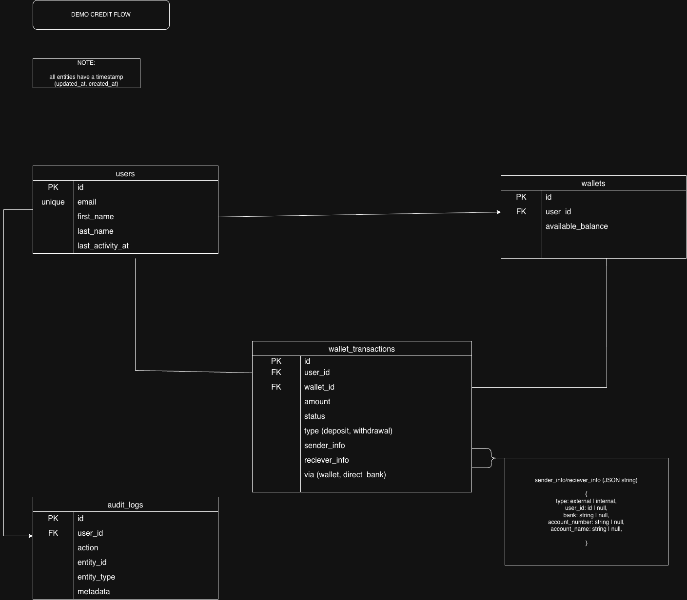

# Node with KnexJS

Industry-standard Node.js API starter built with Express, TypeScript, Knex, MySQL, and unit testing.

## Features

- Express application split into app wiring and server bootstrap
- TypeScript-first structure with OOP-style controllers and services
- Knex + MySQL integration with migrations and seeds
- Transaction-scoped user creation with audit logging
- Zod request validation and centralized error handling
- Jest unit tests covering positive and negative service scenarios

## Project Structure

```text
db/
  knex.ts
  knex-config.ts
  migrations/
  seeds/
models/
  user.model.ts
src/
  controllers/
  middleware/
  repositories/
  routes/
  services/
  validators/
tests/
  unit/
```

## Setup

1. Copy `.env.example` to `.env` and update the MySQL credentials.
2. Install dependencies with `npm install`.
3. Run migrations with `npm run knex:migrate`.
4. Seed sample data with `npm run knex:seed`.
5. Start the dev server with `npm run dev`.

## Scripts

- `npm run dev` starts the API in watch mode.
- `npm run build` compiles TypeScript into `dist/`.
- `npm run typecheck` runs the TypeScript compiler without emitting files.
- `npm run test` runs the unit test suite.
- `npm run knex:migrate` runs the latest migrations.
- `npm run knex:rollback` rolls back the last migration batch.
- `npm run knex:seed` runs seed files.

## E - R Diagram



## API Documentation

https://documenter.getpostman.com/view/19608010/2sBXqRjcjy

- `GET /api/health`
- `GET /api/v1/users`
- `GET /api/v1/users/:id`
- `POST /api/v1/users`

## Create User Example

```json
{
  "firstName": "Ada",
  "lastName": "Lovelace",
  "email": "ada@example.com"
}
```
